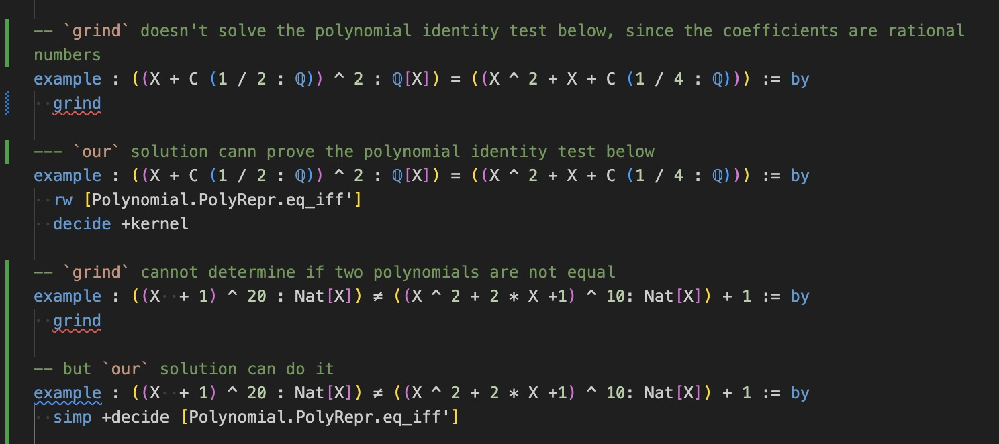

# MonomialOrderedPolynomial
This library provides a formally verified data structure for efficient [polynomial identity testing](https://en.m.wikipedia.org/wiki/Polynomial_identity_testing) via kernel reduction in Lean 4. By leveraging strictly ordered data structures, it ensures reliable in-kernel computation and verification of polynomial operations. Although primarily optimized for polynomial identity testing, the library also supports or plans to support a wide range of fundamental operations, including computing degrees, extracting coefficients, performing evaluations, and handling expansions of both univariate and multivariate polynomials across diverse contexts.

One of the goals of this project is to develop tools that support both the formal verification and the computation of Gröbner bases for polynomial ideals. In addition, it may support other fundamental polynomial operations in the future, including greatest common divisors, factorization, and solving polynomial systems. For our Gröbner basis formalization, see: [WuProver/groebner_proj](https://github.com/WuProver/groebner_proj). This work is still in progress and under active development.

Both the library and its documents are still WIP.

[](https://codespaces.new/WuProver/MonomialOrderedPolynomial)

[](https://gitpod.io/#https://github.com/WuProver/MonomialOrderedPolynomial)


## Introduction

### Main Contents

This library focusses on structure based on list where elements are sorted with an order.

- [`List.lean`](./MonomialOrderedPolynomial/List.lean): General operations and properties of such kind of structure.
- [`DSortedListMap.lean`](./MonoialOrderedPolynomial/DSortedFinsupp.lean): Maps based on sorted list.
- [`DSortedFinsupp.lean`](./MonomialOrderedPolynomial/DSortedFinsupp.lean): A sorted implementation of finitely-supported dependent functions [`DFinsupp`](https://leanprover-community.github.io/mathlib4_docs/find/?pattern=DFinsupp#doc) within the [Mathlib](https://github.com/leanprover-community/mathlib4). It is built upon the [`DSortedListMap`](./MonomialOrderedPolynomial/DSortedListMap.lean) data structure.
- [`SortedFinsupp.lean`](./MonomialOrderedPolynomial/SortedFinsupp.lean): A sorted implementation of finitely-supported functions [`Finsupp`](https://leanprover-community.github.io/mathlib4_docs/find/?pattern=Finsupp#doc) within the [Mathlib](https://github.com/leanprover-community/mathlib4).
- [`SortedAddMonoidAlgebra.lean`](./MonomialOrderedPolynomial/SortedAddMonoidAlgebra.lean): A sorted implementation of [`AddMonoidAlgebra`](https://leanprover-community.github.io/mathlib4_docs/find/?pattern=AddMonoidAlgebra#doc) within the [Mathlib](https://github.com/leanprover-community/mathlib4).
- [`TreeRepr.lean`](./MonomialOrderedPolynomial/TreeRepr.lean): instances that extract a computable tree structure from concrete `Polynomial` and `MvPolynomial` expressions
- [`Polynomial.lean`](./MonomialOrderedPolynomial/Polynomial.lean): equivalence of algebras from `SortedAddMonoidAlgebra` (where monomials are represented as sorted elements of a list) to [`Polynomial`](https://leanprover-community.github.io/mathlib4_docs/find/?pattern=Polynomial#doc).
- [`MonomialOrder.lean`](./MonomialOrderedPolynomial/MonomialOrder.lean): Order on `SortedFinsupp`.
- [`MvPolynomial.Lean`](./MonomialOrderedPolynomial/MvPolynomial.lean): equivalence of algebras from `SortedAddMonoidAlgebra` to [`MvPolynomial`](https://leanprover-community.github.io/mathlib4_docs/find/?pattern=MvPolynomial#doc).

### How It Works

At its core, this library enables computation through a technique known as proof by reflection. We establish a formal isomorphism, defining a two-way translation between incomputable mathematical objects from Mathlib and our computable data structures. This allows the kernel to efficiently reduce concrete expressions about structures we define, and prove proposition about the corresponding objects from Mathlib by the result, while guaranteeing mathematically sound and consistent with the original theory.

## Build
If you don't already have Lean 4 set up, please follow the official [Lean 4 installation instructions](https://leanprover-community.github.io/get_started.html).

Once Lean is installed, you can clone this repository and build the project:
```bash
git clone https://github.com/WuProver/MonomialOrderedPolynomial.git
cd MonomialOrderedPolynomial
lake exe cache get
lake build
```

## Capabilities about `MvPolynomial` and `Polynomial`

This library provides support for operations of polynomials (`MvPolynomial` and `Polynomial`) on `SortedAddMonoidAlgebra`:

- const,
- variable,
- addition / subtraction,
- multiplication,
- exponentiation.

One of their applications is [PIT (polynomial identity testing)](https://en.m.wikipedia.org/wiki/Polynomial_identity_testing).

Corresponding `SortedAddMonoidAlgebra` of concrete polynomials can be synthesized via instance. Some examples are in [PolynomialExamples.lean](https://github.com/WuProver/MonomialOrderedPolynomial/blob/master/LeanSortedFinsupp/PolynomialExamlpes.lean).

### `Polynomial`-specific Operations

- Degree Computation (WIP, still not sorry-free): Calculation of polynomial degrees
- Coefficient Extraction (WIP, still not sorry-free): Retrieval of specific coefficients from polynomial expressions

```lean
open Polynomial

example : ((X ^ 3 + C 1) ^ 3 - X ^ 9: Int[X]).degree = 6 := by
  rw [Polynomial.PolyRepr.degree_eq]
  decide +kernel

example : ((X ^ 3 + C 1) ^ 3 - X ^ 9: Int[X]).degree ^ 2 = 36 := by
  rw [Polynomial.PolyRepr.degree_eq]
  decide +kernel

example : (((X + C (1 / 2 : ℚ)) ^ 3 : ℚ[X]) - X ^ 3).leadingCoeff = (3 / 2 : ℚ) := by
  rw [Polynomial.PolyRepr.leadingCoeff]
  decide +kernel

example : (((X + C (1 / 2 : ℚ)) ^ 3 : ℚ[X]) - X ^ 3).coeff 1 = (3 / 4 : ℚ) := by
  rw [Polynomial.PolyRepr.coeff]
  decide +kernel
```

### `MvPolynomial`-specific Operations

- Degree Computation (TODO): Calculation of polynomial degrees w.r.t. a specific monomial order (such as lexicographic order);
- Coefficient Extraction (TODO): Retrieval of specific coefficients from polynomial expressions w.r.t. a specific monomial order.

## Comparison on PIT

Our comparison is confined solely to polynomial operations within polynomial rings. Moreover, we only consider the case of processing a single goal or a single hypothesis.

### Comparison Table

| Goal | Requirement (Our Tool) | Requirement (Grind) | Notes & Implications |
| :--- | :--- | :--- | :--- |
| **Equality** | ✅ polynomials with computable coefficients, and independent of hypotheses | ✅ provable by general properties of commutative semiring/ring | Our tool can prove polynomial equalities by performing explicit computations on the coefficients, but only when the coefficients are computable and the polynomial is given concretely. In contrast, grind is faster and  may establish an equality even when the equality, or some of its subterms, depend on hypotheses, but it cannot exploit any information beyond the general algebraic laws of a commutative semiring or ring. |
| **Disequality** | ✅ (same requirements as equality) | ❌ **Not Supported, except some trivial cases** | Grind can only prove equality, but never inequality except some trivial ones. When the equality does not hold, it just fails instead of proving. |

### Some Examples
<!--  -->

#### `Polynomial`

`grind` doesn't solve the polynomial identity test below, since the coefficients are rational numbers and it doesn't know `Polynomial.C`:
```lean
open Polynomial in
example : ((X + C (1 / 2 : ℚ)) ^ 2 : ℚ[X]) = ((X ^ 2 + X + C (1 / 4 : ℚ))) := by
  fail_if_success grind  -- `grind` failed
  sorry
```

Our solution can prove the polynomial identity below
```lean
open Polynomial in
example : ((X + C (1 / 2 : ℚ)) ^ 2 : ℚ[X]) = ((X ^ 2 + X + C (1 / 4 : ℚ))) := by
  rw [Polynomial.PolyRepr.eq_iff']
  decide +kernel
```

`grind` cannot determine if two polynomials are not equal
```lean
open Polynomial in
example : ((X + 1) ^ 20 : Nat[X]) ≠ ((X ^ 2 + 2 * X +1) ^ 10: Nat[X]) + 1 := by
  fail_if_success grind  --`grind` failed
  sorry
```

but our solution can do it
```lean
open Polynomial in
example : ((X + 1) ^ 20 : Nat[X]) ≠ ((X ^ 2 + 2 * X +1) ^ 10: Nat[X]) + 1 := by
  simp +decide [Polynomial.PolyRepr.eq_iff']
```

`grind` can prove some goals dependent on hypotheses, including but not limited to abstract algebra structures, unknown polynomials, and equations.
```lean
open Polynomial in
example {R : Type*} [CommRing R] (p : Polynomial R) : p + 1 + X = 1 + p + X := by
  grind

open Polynomial in
example {R : Type*} [CommRing R] (p q : Polynomial R) (h : p + 1 = q) :
    p ^ 2 - 1 + Polynomial.X = q ^ 2 - 2 * q + Polynomial.X := by
  grind
```

but not our tools
```lean
open Polynomial in
example {R : Type*} [CommRing R] [DecidableEq R] :
    1 + X = (X + 1 : R[X]) := by
  rw [Polynomial.PolyRepr.eq_iff']
  fail_if_success decide +kernel -- failed: `Expected type must not contain free variables`
  fail_if_success decide +kernel +revert --failed: `failed to synthesize`
  sorry

open Polynomial in
example (p : Polynomial Int) :
    1 + p = (p + 1 : Int[X]) := by
  fail_if_success { rw [Polynomial.PolyRepr.eq_iff'] } -- failed: `failed to synthesize`
  sorry
```

#### `MvPolynomial`

Equality:
```lean
open MvPolynomial in
example : ((X 0 + X 1 + 1) ^ 10 : MvPolynomial Nat Nat) ≠ ((X 1 ^ 2 + 2 * X 1 +1) ^ 5) := by
  rw [ne_eq, MvPolynomial.PolyRepr.eq_iff']
  decide +kernel
```

Disequality:
```lean
open MvPolynomial in
example : ((X 0 + X 1) ^ 10 : MvPolynomial Nat Nat) = ((X 1 ^ 2 + 2 * X 0 * X 1 + X 0 ^ 2) ^ 5) := by
  rw [MvPolynomial.PolyRepr.eq_iff']
  decide +kernel
```

## WIP

1. clean up code;
2. refactor `SortedFinsupp` to replace dependent sum type `Sigma` (used as key-value pair) with independent `Prod`, to make it much more faster;
3. a user-friendly way to interact with exponents and monomial order of `MvPolynomial`;
4. prove equalities via homomorphism from computable structure (such as `ℕ`, `ℤ`, `ℚ`, and `ZMod n`) to incomputable ones, and prove disequalities via embedding into them.

## Thanks

This project, especially the way to synthesize computable structure from incomputable expressions, is inspired by [Junyan Xu](https://github.com/alreadydone)'s [work on polynomial computations by reflection](https://gist.github.com/alreadydone/2dca4fde11fb2e9be7f8a10b59216b3f). And the computable structure of this project is inspired by [the implementation](https://github.com/leanprover/lean4/blob/c2876a1a6a42e6df458ffb37abbc3868632beb58/src/Init/Grind/CommRing/Poly.lean) of [the algebraic solver of Grind](https://lean-lang.org/doc/reference/latest/The--grind--tactic/Algebraic-Solver-_LPAR_Commutative-Rings___-Fields_RPAR_).
